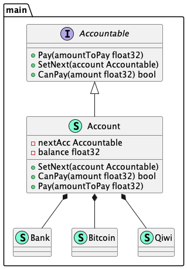

# Chain of responsibility (Цепочка обязанностей)

**Chain of responsibility** helps to build chains of objects. The request enters from one end and 
passes through each object until it finds a suitable handler.

**Цепочка обязанностей** помогает строить цепочки объектов. Запрос входит с одного конца и проходит 
через каждый объект, пока не найдет подходящий обработчик.

### Theoretical UML Diagram

### Implemented Diagram

