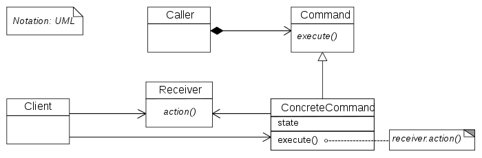
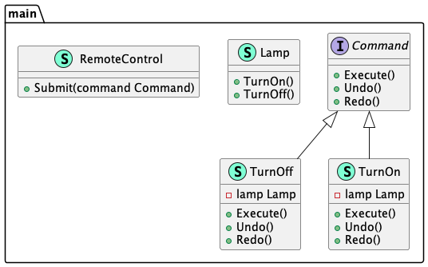

# Command (Команда)

**Command** pattern allows you to encapsulate actions into objects. The main idea behind 
the template is the provision of funds to separate the client and the recipient.

**Команда** позволяет вам инкапсулировать действия в объекты. Основная идея, стоящая 
за шаблоном — это предоставление средств, для разделения клиента и получателя.

### Theoretical UML Diagram

### Implemented Diagram

