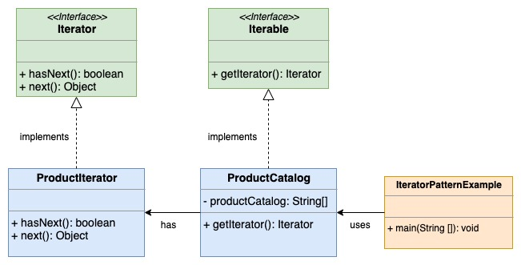
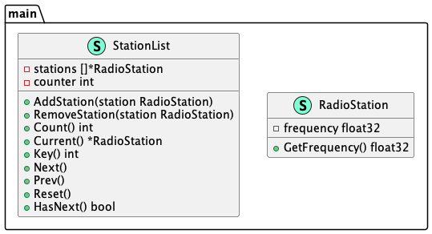

# Iterator (Итератор)

**Iterator** pattern represents a way to access the elements of an object without showing the 
base view.

**Итератор** представляет способ доступа к элементам объекта без показа базового представления.

### Theoretical UML Diagram

### Implemented Diagram

