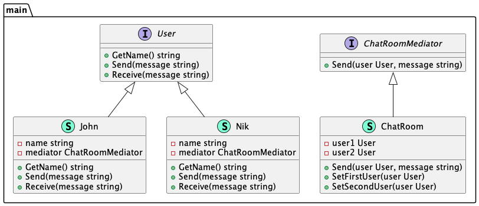

# Mediator (Посредник)

**Mediator** pattern implies the addition of a third-party object (intermediary) to manage the 
interaction between two objects (colleagues). The template helps to reduce the coupling of classes 
communicating with each other, because now they do not need to know about the implementations of 
their interlocutors.

Шаблон **посредник** подразумевает добавление стороннего объекта (посредника) для управления 
взаимодействием между двумя объектами (коллегами). Шаблон помогает уменьшить связанность (coupling) 
классов, общающихся друг с другом, ведь теперь они не должны знать о реализациях своих собеседников.

### Theoretical UML Diagram

### Implemented Diagram

