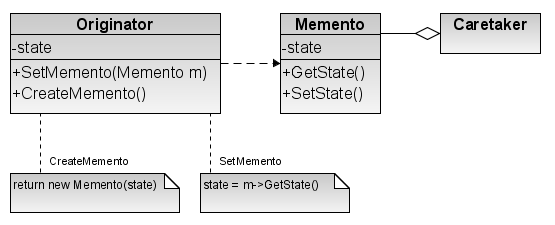
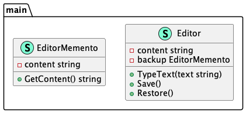

# Memento (Хранитель)

**Memento** pattern captures and stores the current state of the object so that it can be easily 
restored.

Шаблон **хранитель** фиксирует и хранит текущее состояние объекта, чтобы оно легко 
восстанавливалось.

### Theoretical UML Diagram

### Implemented Diagram

