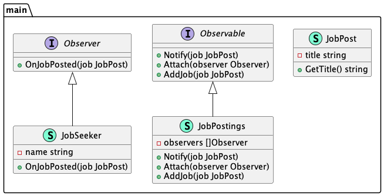

# Observer (Наблюдатель)

**Observer** pattern defines a dependency between objects so that when the state of one of them 
changes, its dependents will know about it.

Шаблон **наблюдатель** определяет зависимость между объектами, чтобы при изменении состояния одного 
из них зависимые от него узнавали об этом.

### Theoretical UML Diagram

### Implemented Diagram

