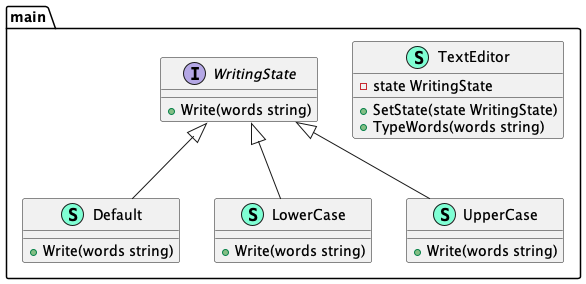

# State (Состояние)

**State** pattern allows you to change the behavior of the class when the state changes.

Шаблон **состояние** позволяет менять поведение класса при изменении состояния.

### Theoretical UML Diagram

### Implemented Diagram

