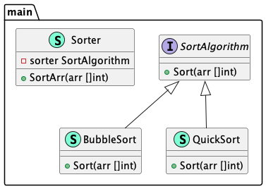

# Strategy (Стратегия)

**Strategy** pattern allows you to switch between algorithms or strategies depending on the 
situation.

Шаблон **стратегия** позволяет переключаться между алгоритмами или стратегиями в зависимости от 
ситуации.

### Theoretical UML Diagram

### Implemented Diagram

