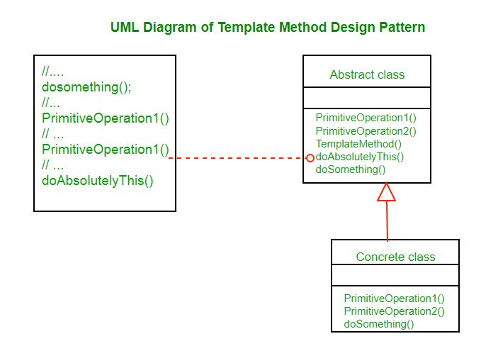
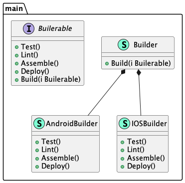

# Template method (Шаблонный метод)

**Template method** defines the framework for executing a certain algorithm, but delegates the implementation of the stages themselves to child classes.

**Шаблонный метод** определяет каркас выполнения определённого алгоритма, но реализацию самих этапов делегирует дочерним классам.

### Theoretical UML Diagram

### Implemented Diagram

