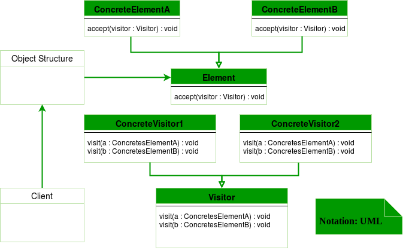
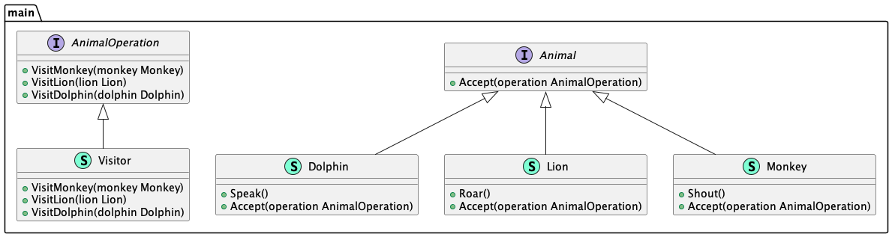

# Visitor (Посетитель)

**Visitor** pattern allows you to add future operations for objects without modifying them.

Шаблон **посетитель** позволяет добавлять будущие операции для объектов без их модифицирования.

### Theoretical UML Diagram

### Implemented Diagram

