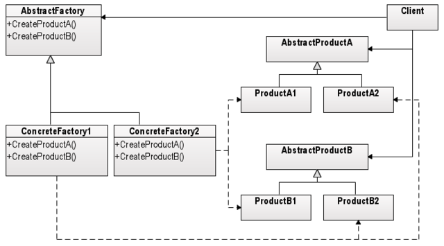
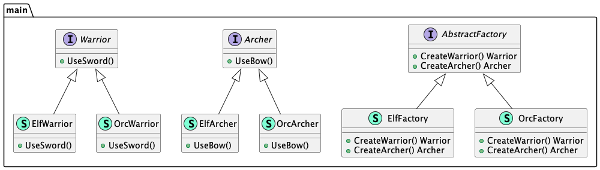

# Abstract factory (Абстрактная фабрика)

**Abstract factory** creates a family of related or interdependent objects.

**Абстрактная фабрика** создаёт семейство взимосвязанных или взаимозависимых объектов.

### Theoretical UML Diagram

### Implemented Diagram

