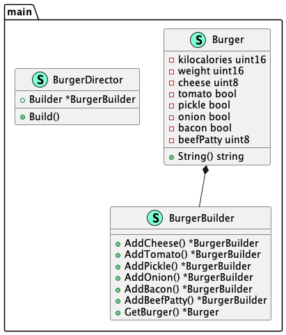

# Builder (Строитель)

**Builder** provides a way to create a composite object.
Designed to solve the problem of the antipattern "Telescopic Constructor"

**Строитель** предоставляет способ создания составного объекта.
Предназначен для решения проблемы антипаттерна «Телескопический конструктор»

### Theoretical UML Diagram

### Implemented Diagram

