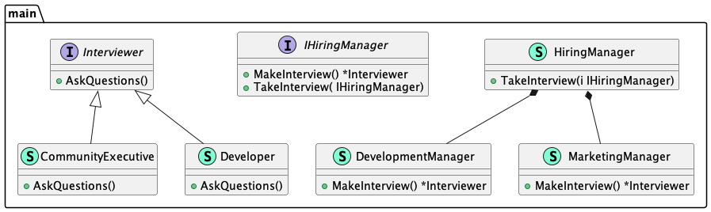

# Factory method (Фабричный метод)

**Factory method** delegates the creation of objects to inheritors of the parent class.

**Фабричный метод** делегирует создание объектов наследникам родительского класса.

