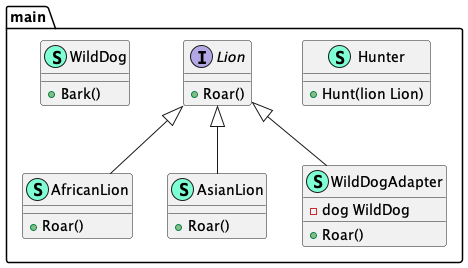

# Adapter (Адаптер)

**Adapter** allows you to wrap incompatible objects in an adapter to make them compatible with 
another class.

**Адаптер** позволяет обернуть несовместимые объекты в адаптер, чтобы сделать их совместимыми с 
другим классом.

### Theoretical UML Diagram

### Implemented Diagram

