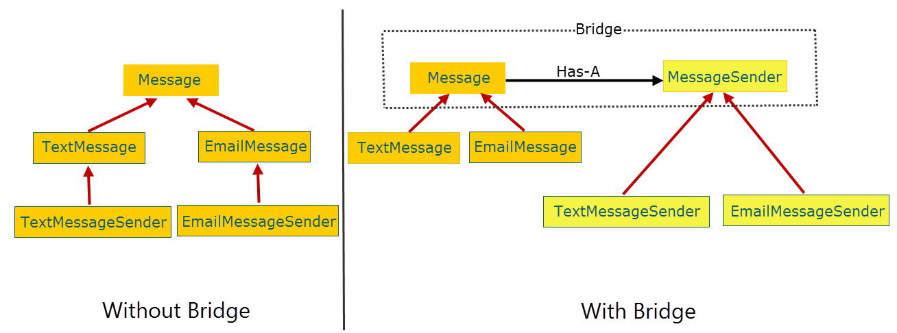
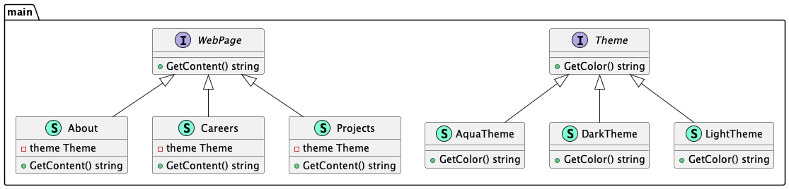

# Bridge (Мост)

**Bridge** pattern is a preference for composition over inheritance. Implementation details are passed from one hierarchy to another object with a separate hierarchy.

Паттерн **мост** это предпочтение композиции над наследованием. Детали реализации передаются из одной иерархии в другой объект с отдельной иерархией.

### Theoretical UML Diagram

### Implemented Diagram

