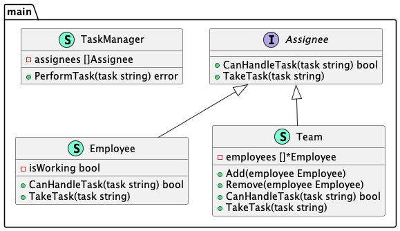

# Composite (Компоновщик)

**Composite** pattern allows clients to work with individual objects in a single style.

Шаблон **компоновщик** позволяет клиентам работать с индивидуальными объектами в едином стиле.

### Theoretical UML Diagram

### Implemented Diagram

