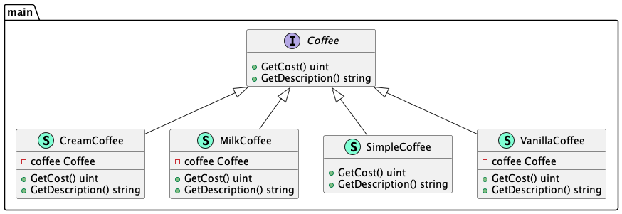

# Decorator (Декоратор)

**Decorator** pattern allows you to dynamically change the behavior of an object during operation 
by wrapping them in an object of the decorator class.

Шаблон **декоратор** позволяет вам динамически изменять поведение объекта во время работы, 
оборачивая их в объект класса декоратора.

### Theoretical UML Diagram

### Implemented Diagram

