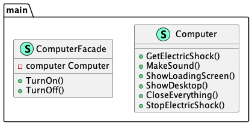

# Facade (Фасад)

**Facade** pattern provides a simplified interface for a complex system.

Шаблон **декоратор** предоставляет упрощенный интерфейс для сложной системы.

### Theoretical UML Diagram

### Implemented Diagram

