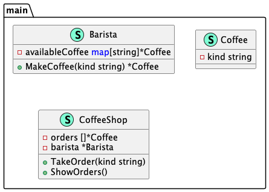

# Flyweight (Приспособленец)

**Flyweight** pattern is used to minimize memory usage or computational cost by dividing resources with the largest number of similar objects.

**Приспособленец** используется для минимизации использования памяти или вычислительной стоимости путем разделения ресурсов с наибольшим количеством похожих объектов.

### Theoretical UML Diagram

### Implemented Diagram

