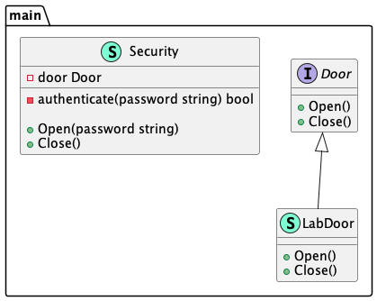

# Proxy (Заместитель)

Class displays the functionality of another class by **proxy** pattern.

Используя паттерн **заместитель** класс отображает функциональность другого класса.

### Theoretical UML Diagram

### Implemented Diagram

